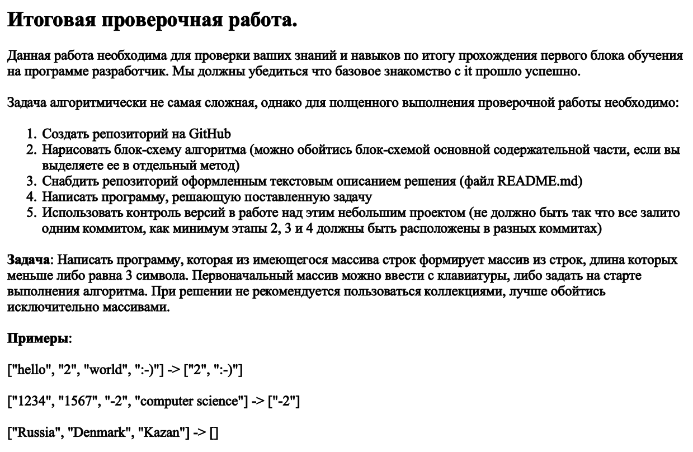
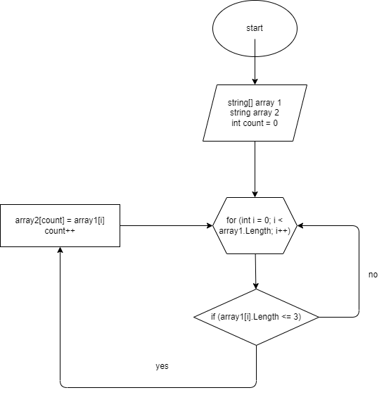

# GB_ControlWork 

## 1. Создать репозиторий на GitHub

GitHub это удобный удаленный репозиторий, помогающий даже не очень опытным пользователям.

Для того, чтобы наш проект при синхронизации не добавлял системные файлы добавим в корень проекта файл.

**.gitignore**

который содержит перечень данных, которые нет необходимости отслеживать в системе контроля версий.

Запустим терминал и выполним команду

**dotnet new console**

## 2. Нарисовать блок-схему алгоритма

Для выполнения этой части задания я воспользовался расширением для VSCode

**Draw.io Integration**

Это позволяет создать файл с расширением

**.drawio.png**

который языком разметки Markdown будет восприниматься как изображение, но появляется возможность вносить в блок-схему изменения.

## Блок-схема

## 3. Снабдить репозиторий оформленным текстовым описанием решения

Сначало объявляется два массива: изначальный и вторый такой же длины. Потом метод, в котором цикл соразмерный длине массива, внутри цикла проверка условия (<=3), если да, элемент первого массива заносится в count элемент второго массива. Переменная count, чтобы поочередно закидывать из первого массива во второй и, чтобы потом не было пробелов. После присвоения увеличивается переменная count на 1 и возвращается к циклу for в котором i увеличивается на 1. И так проверяется до конца.

## 4. Написать программу, решающую поставленную задачу

Составление примерного алгоритма и написание программы заняло не большое количество времени, а вот оформление блок-схемы, создание файла README.md, добавление иллюстраций заняло больше и требовало правок во время написания работы.

## 5. Использовать контроль версий в работе над этим проектом

Git, как система контроля версий и GitHub, как удаленный репозиторий позволяют не только сохранять и контролировать изменения в работе, но и даёт возможность работать одновременно с нескольких устройств, что и было использовано в данной работе.